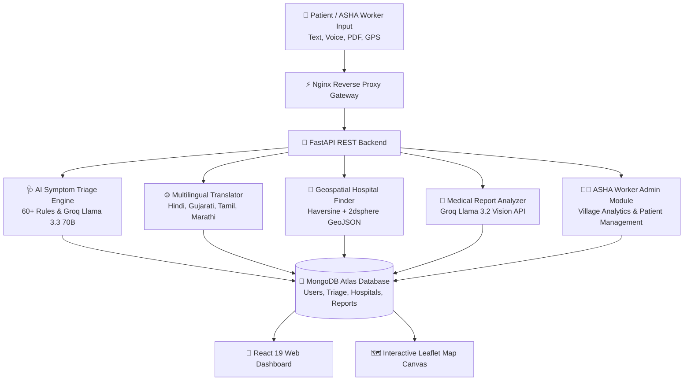

🏥 HealthMitra — Production AI-Powered Rural Healthcare Platform
FastAPI React MongoDB Groq Docker AWS TailwindCSS

An Enterprise-Grade AI-Powered Healthcare Platform designed specifically for rural India. Built with FastAPI, React 19, MongoDB Atlas, Groq Llama 3.3 70B & Llama 3.2 Vision, Nginx, and Docker.

Featuring AI-Powered Symptom Triage, Multilingual NLP (English, Hindi, Gujarati, Tamil, Marathi), GPS Geospatial Hospital Discovery (Haversine & 2dsphere), Vision Medical Report Analyzer, ASHA Community Worker Dashboard, Bcrypt/JWT Security, and Full Microservice Containerization.

## 🏗️ System Architecture & End-to-End Data Flow

The platform implements an asynchronous, microservice architecture spanning from hands-free voice and text input down to Groq Vision document analysis and geospatial hospital retrieval.



---


🔥 Key Technical Highlights & Features
1. 🩺 AI-Powered Symptom Triage & Multilingual NLP
Rule-Based & LLM Fallback Engine: Classifies symptoms into 3 urgency tiers (Self-Care, Visit Clinic, Emergency) across 60+ deterministic medical rules and Groq/Llama reasoning.
Multilingual Support: Supports 5 Indian languages (English, Hindi, Gujarati, Tamil, Marathi) using Groq Llama 3.3 70B for zero-shot medical translation and context retention.
Voice Input Integration: Web Speech API implementation enabling hands-free voice symptom entry for low-literacy users.
2. 📄 Medical Report & Lab Analyzer (Groq Llama 3.2 Vision)
Multi-Modal Document Parsing: Upload PDF or image lab reports (CBC, Lipid Panel, Radiology).
Vision Extraction Pipeline: Powered by Groq Llama 3.2 Vision to extract medical entities, abnormal values, and plain-language patient explanations.
3. 🏨 Geospatial Hospital Discovery Engine
GPS Location Detection: Browser Geolocation API with IP-based fallback mechanisms.
Haversine Distance & 2dsphere Indexing: Computes exact distance in kilometers to 20+ pre-seeded regional hospitals and health centers across India.
Interactive Leaflet Canvas: Visual map interface with distance sorting, emergency contact triggers, and navigation directions.
4. 👩‍⚕️ ASHA Community Worker Dashboard
Village Healthcare Management: Specialized portal for Accredited Social Health Activists (ASHA) to monitor community health trends.
Patient History & Analytics: Role-based aggregated metrics, emergency alerts, and triage record management.
5. 🛡️ Role-Based Security & Auth Engine
JWT Authorization: Cryptographically signed JSON Web Tokens (python-jose) enforcing Patient and ASHA_Worker role permissions.
Bcrypt Password Security: Direct salted password hashing protecting user data privacy.
6. 💊 OTC Medicine Information & Safety Engine
Over-the-Counter Guidance: Database of essential OTC medications, dosages, and safety precautions.
Drug Interaction Checker: Basic interaction warnings preventing unsafe self-medication.
## 📁 Repository Folder Structure

```
healthmitra/
├── backend/                        # FastAPI Backend Service
│   ├── app/
│   │   ├── models/                 # Pydantic Data Models (User, Triage, Hospital, Report)
│   │   ├── routes/                 # FastAPI REST Endpoints (Auth, Triage, Hospitals, Reports, Admin)
│   │   ├── services/               # Business Logic Layer (Triage Engine, Hospital Finder, Vision Analyzer)
│   │   └── utils/                  # JWT Security & Password Hashing
│   ├── main.py                     # FastAPI Application Entry Point & CORS Setup
│   ├── requirements.txt            # Python Dependencies
│   └── Dockerfile                  # Production Uvicorn Container Specs
├── frontend/                       # React 19 Web Dashboard
│   ├── public/                     # Favicons & Static Assets
│   ├── src/
│   │   ├── components/             # Reusable UI Components (Navbar, Cards, Modals)
│   │   ├── pages/                  # Views (Landing, Dashboard, SymptomChecker, Hospitals, Reports, Admin)
│   │   ├── services/               # Axios API Client Integration
│   │   └── App.js                  # React Router Navigation & Protected Routes
│   ├── nginx.conf                  # Frontend Nginx Server Config
│   └── Dockerfile                  # Multi-Stage Build Container Specs
├── nginx/                          # Reverse Proxy Gateway
│   ├── nginx.conf                  # Request Routing (Frontend :80, Backend API /api)
│   └── Dockerfile                  # Nginx Container Image Specs
├── assets/                         # Interface Screenshots & Visual Assets
├── docker-compose.yml              # Multi-Container Microservice Orchestration
└── README.md                       # Main Project Documentation
```

---

📸 Platform Interface Screenshots & Dashboards
🌐 Live Deployment: http://13.232.60.226/

1. 📊 Main Patient Dashboard
Main Dashboard


2. 🩺 AI Symptom Checker Interface
Symptom Checker


3. 🎯 Emergency & Urgency Triage Result


4. 🏨 GPS Hospital Locator & Leaflet Map
Hospital Locator


5. 📄 AI PDF Medical Report Analyzer
Report Analyzer


6. 🚨 Emergency SOS & Helpline Panel
Emergency SOS


7. 🔐 User Authentication Portal
Login Page


8. 🌐 Public Platform Landing Page
Landing Page


🚀 Quickstart & Installation
Option A: Running with Docker Compose (Recommended)
# 1. Clone the repository
git clone https://github.com/Jaydeep0832/healthmitra.git
cd healthmitra

# 2. Configure environment variables in .env at project root
# Add MONGO_URI and GROQ_API_KEY

# 3. Build and launch all microservices in detached mode
docker-compose up --build -d

# 4. Verify running containers
docker-compose ps
Access services:

Frontend Dashboard: http://localhost
Backend REST API Docs: http://localhost:8000/docs
Option B: Running Locally
1. Backend Setup
cd backend
python -m venv venv
venv\Scripts\activate      # On Windows (source venv/bin/activate on Linux/Mac)
pip install -r requirements.txt
cp .env.example .env       # Configure MONGO_URI and GROQ_API_KEY
uvicorn main:app --reload --port 8000
2. Frontend Setup
cd frontend
npm install
npm start                  # Runs on http://localhost:3000
🔗 REST API Reference
Method	Endpoint	Description
POST	/api/auth/register	Register new patient or ASHA worker user
POST	/api/auth/login	Authenticate user and issue JWT bearer token
POST	/api/triage/text	Submit symptom description for AI urgency triage
GET	/api/triage/history	Retrieve user triage history
GET	/api/hospitals/nearby	Query nearest healthcare facilities by GPS coordinates
POST	/api/reports/upload	Upload PDF/Image lab report for Groq Vision analysis
GET	/api/medicines/recommend	Query OTC medicine information and safety advice
GET	/api/admin/stats	Access system health metrics and village analytics (ASHA admin)
Full interactive documentation available via Swagger UI at /docs when backend is running.

📊 Database Architecture (MongoDB Atlas)
Database: healthmitra · 4 Collections · 10 Indexes

Collection	Doc Count	Key Fields & Indexing
hospitals	20	name, specialty, phone, GPS coordinates — 2dsphere geospatial index
users	17	profile, language preference, health history, emergency contact — email unique index
triage_records	18	input text, detected entities, triage level, advice, timestamp — user_id index
reports	4	S3/storage key, extracted text, medicines[], test results[], uploaded_at
🔮 Future Roadmap & Enhancements
🌐 Offline PWA Mode: Progressive Web App caching for low-connectivity rural zones.
📱 WhatsApp & SMS Gateway: Integration with Twilio/Gupshup for feature phone access.
👨‍⚕️ Telemedicine Scheduling: Direct video/voice appointment booking with medical officers.
⌚ IoT Vitals Synchronization: Integration with low-cost Bluetooth vitals monitors (SpO2, BP).
⚠️ Disclaimer
HealthMitra provides AI-based preliminary health guidance only. It is not a substitute for professional medical diagnosis, advice, or treatment. Always consult a qualified healthcare provider for medical concerns. In life-threatening emergencies, immediately contact 108 (Ambulance) or 102 (Medical Helpline).

📜 License
Distributed under the MIT License. See LICENSE for details.
